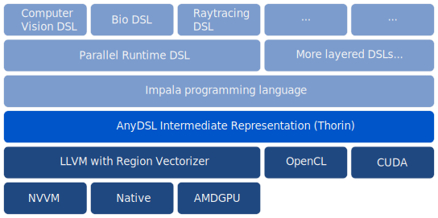

The core of AnyDSL is the ability to create (conceptual) abstractions over multiple levels of hierarchies, passing higher-order functions and thus their functionality through (multiple) of these levels, optionally warping them in suitable code and interface implementations, and finally optimize the resulting combined code at the lower levels where we know about the specific hardware architectures and its capabilities.
In contrast to most common languages, any perceived overhead of these conceptual abstractions can be completely eliminated in AnyDSL.

## Motivation and Key Features

- TODO

## AnyDSL Architecture



## AnyDSL's Language *Impala*

As creating a front-end for some language is a complex and time-consuming endeavor, we offer Impala.
This is an imperative language which features as a basis well-known imperative constructs.
A DSL developer can hijack Impala such that desired domain-specific types and constructs are available in Impala simply by declaring them.
The DSL developer just reuses Impala's infrastructure (lexer, parser, semantic analysis, and code generator).
He does not need to develop his own front-end.
Even more important:
The decision how to implement domain-specific details is postponed to the expert of the target machine.

## Embedding of DSLs in Impala

We realize a *separation of concerns* through code refinement using
− Higher-order functions,
− Partial evaluation and
− Triggered code generation.

### Application Developer

```rust
fn main() {
    let img = load("dragon.png");
    let blurred = gaussian_blur(img);
}
```

### DSL Developer

```rust
fn gaussian_blur(field: Field) -> Field {
    let stencil: Stencil = { /* ... */ };
    let mut out: Field   = { /* ... */ };

    for x, y in @iterate(out) {
        out.data(x, y) = apply_stencil(x, y, field, stencil);
    }

    out
}
```

### Machine Expert

```rust
fn iterate(field: Field, body: fn(int, int) -> ()) -> () {
    let grid  = (field.cols, field.rows, 1);
    let block = (128, 1, 1);

    with nvvm(grid, block) {
        let x = nvvm_tid_x() + nvvm_ntid_x() * nvvm_ctaid_x();
        let y = nvvm_tid_y() + nvvm_ntid_y() * nvvm_ctaid_y();
        body(x, y);
    }
}
```

## Selected Results of some Usecases

### Stincilla

*Stincilla* is a DSL for stencil codes. We used the Gaussian blur filter as example and compared against the implementations in OpenCV 3.0 as reference.
Thereby, we achieved the following results:
- Intel CPU: 40% faster
- Intel GPU: 25% faster
- AMD GPU: 50% faster
- NVIDIA GPU: 45% faster
- Up to 10x shorter code

### RaTrace

*RaTrace* is a DSL for ray traversal.
- 17% faster on NVIDIA GTX 970 (reference: Aila et al.)
- 11% faster on Intel Core i7-4790 using type inference (reference: Embree)
- 10% slower on Intel Core i7-4790 using auto-vectorization (reference: Embree)
- 1/10th of coding time according to Halstead measures
